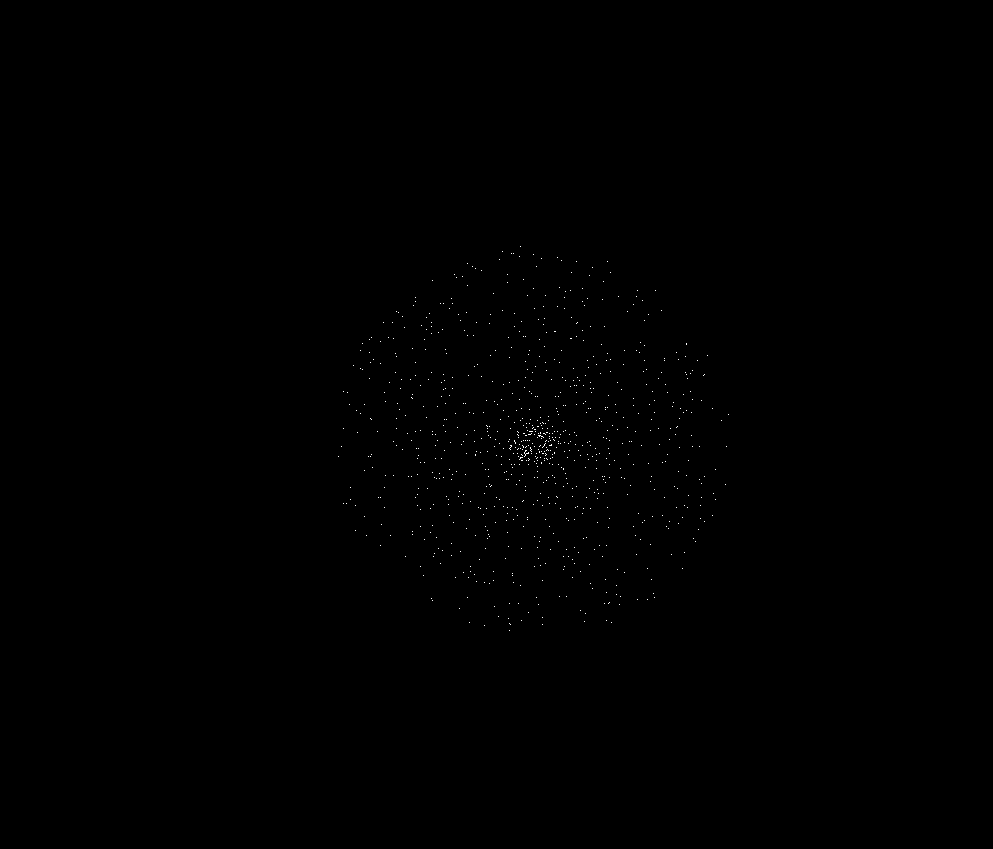

Barnes_Hut_Demo
===================


## Overviwe
C++, SFML n-body simulation using Barnes-Hut algorithm

## Requirements
1. Eigen: High performance C++ linear algebra library
2. SFML: Multimedia library to handle graphics and visualization
3. C++ 17 or higher compiler

### Linux Installation
1. Install Eigen, SFML
``` shell
sudo apt-get install libeigen3-dev 
sudo apt-get install libsfml-dev
```
2. Clone Repository
```shell
git clone https://github.com/yourusername/Barnes_Hut_Demo.git
cd Barnes_Hut_Demo
```
3. Compile
```shell
mkdir build && cd build
cmake ..
make
```
### Windows Installation
1. Install Eigen, SFML
``` shell
vcpkg install eigen3:x64-windows
vcpkg install sfml:x64-windows
```
2. Clone Repository
```shell
git clone https://github.com/yourusername/Barnes_Hut_Demo.git
cd Barnes_Hut_Demo
```
3. Compile
```shell
mkdir build && cd build
cmake ..
make
```
## Controls
- WASD, arrows to move up, down, left, right
- Mouse wheel to zoom
